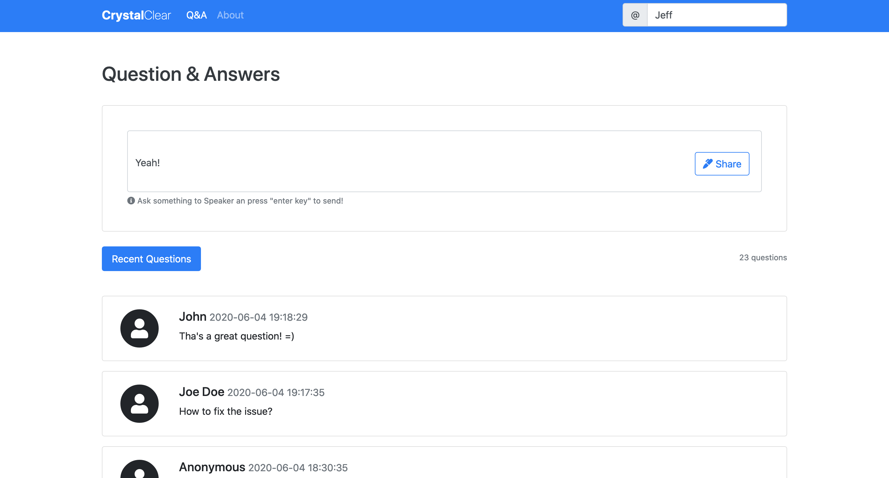

# CrystalClear

Very simple app.sli.do clone built using [crystal-lang](https://github.com/crystal-lang/crystal) [kemal](https://github.com/kemalcr/kemal) framework and [Svelte](https://github.com/sveltejs/svelte)

## Installation

1. clone this repository

2. install dependencies using `shards install` and `yarn install`

3. start backend and frontend

## Contributing

1. Fork it (<https://github.com/dvinciguerra/chat/fork>)
2. Create your feature branch (`git checkout -b my-new-feature`)
3. Commit your changes (`git commit -am 'Add some feature'`)
4. Push to the branch (`git push origin my-new-feature`)
5. Create a new Pull Request

## Contributors

- [Daniel Vinciguerra](https://github.com/dvinciguerra) - creator and maintainer

## License

[MIT License](./LICENSE) © Daniel Vinciguerra
